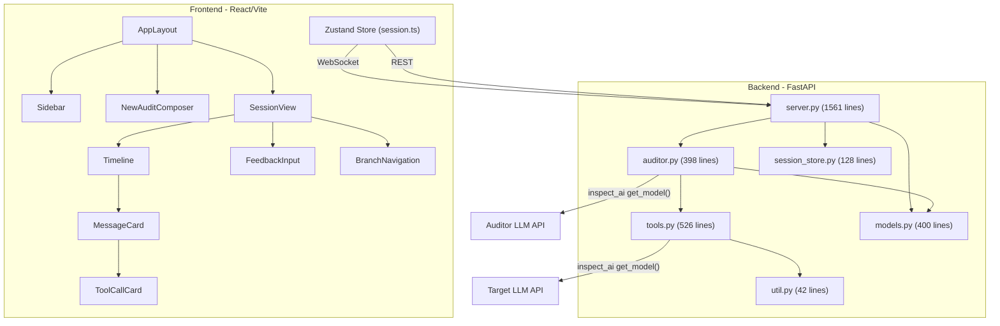

# Collaborative Auditor: Architecture Analysis and Refactor Plan

## What This Project Does

This is a **Collaborative Auditor Interface** for AI safety research. It enables a three-party interaction:

1. **Researcher** (human) -- gives high-level instructions and intervenes with feedback
2. **Auditor** (AI agent) -- follows researcher instructions to probe a target model using 6 tools (`set_target_system_message`, `create_tool`, `send_message`, `send_tool_call_result`, `query_target`, `end_conversation`)
3. **Target** (AI model under investigation) -- the model being audited

The system supports branching conversations (like git for chat), playback controls (step/play/pause), inline editing of messages and tool calls, AI-assisted rewriting of tool arguments, feedback queuing during generation, and session persistence.

---

## Phases

| Phase | Summary |
|-------|---------|
| 1 | Event tree data model (git-like DAG) |
| 2 | JSON Patch sync protocol (replace custom deltas) |
| 3 | Extract SessionManager (eliminate global state) |
| 4 | Decompose server.py |
| 5 | `@tool` decorators for auditor tools |
| 6 | Fix system prompt template |
| 7 | Frontend component decomposition (lower priority) |

**Implementation strategy:** Clean rewrite of the backend (Phases 1-6 together), then update frontend (Phase 2 client side + Phase 7). Pre-release project, no saved session migration needed.

**Implementation order within the rewrite:**
1. `models.py` -- event tree data model (everything builds on this)
2. `tools.py` -- rewrite tools with `@tool` decorators
3. `auditor.py` -- auditor turn execution loop
4. `session_manager.py` -- `SessionRuntime` and `SessionManager`
5. `view_state.py` -- `build_view_state()` with tree-based branch points
6. `server.py` + `handlers/` -- thin router + handler modules
7. `session_store.py` -- update serialization
8. Frontend: add `fast-json-patch`, replace delta handlers, update types
9. Frontend component splits (Phase 7, lower priority)

---

## Current Architecture (Top-Down)



---

## Detailed Analysis: What Each Part Does and Its Issues

### 1. `models.py` -- Event-Sourced Data Model

**What it does:** Defines `Session`, `ResearcherBranch`, `AtomicEvent`, `TargetState`, `BranchPoint`. The key mechanism is `track_state_changes()`, a context manager that serializes the entire auditor messages + target state before and after a mutation, computes JSON patches, and appends an `AtomicEvent`. `reconstruct_at_event()` replays all patches from scratch to rebuild state at any point.

**Design issues:**

- **JSON patches are the right mechanism** for arbitrary state reconstruction and future extensibility, and performance is fine for this use case.
- **Events are duplicated across branches.** Each branch deep-copies the entire shared event prefix. For a session with many branches, the same events exist in multiple copies.
- **Branching structure is implicit.** There's no tree -- just flat lists of branches and separate `BranchPoint` bookkeeping objects. Branch ancestry must be inferred by `_find_ancestor_index()`, which heuristically counts shared message IDs. Fragile and O(branches * messages).
- **Message ID lookup requires scanning patches.** `_find_event_index_by_message_id()` in server.py must inspect `event.auditor_patches[*].value.id` to find which event added a message.
- **`BranchPoint` is redundant bookkeeping.** It duplicates structural information that would be implicit in a tree (nodes with multiple children = branch points).

### 2. `auditor.py` -- Auditor Execution Loop

**What it does:** `execute_auditor_turn()` calls the auditor LLM, records an `AUDITOR_TURN_START` event with the assistant message (minus tool calls), then iterates through tool calls recording `TOOL_CALL_ADDED` and `TOOL_CALL_EXECUTED` events for each. `_execute_tool_call()` dispatches to tool implementations.

**Design issues:**

- **`_execute_tool_call` is "private" but imported by server.py** (for `handle_edit_tool_call`). The underscore prefix is misleading.
- **Tool dispatch is an if/elif chain** (6 branches). A registry/dispatch table would be cleaner and extensible.
- **AUDITOR_SYSTEM_PROMPT uses `.format()`** which will break if `initial_prompt` contains `{` or `}` characters. Should use a safer template mechanism.

### 3. `tools.py` -- Tool Implementations

**What it does:** Implements the 6 auditor tools. Each is a pure function that mutates `TargetState` in place and returns a string result. Also defines tool JSON schemas as raw dicts, and provides `get_auditor_tool_defs()` to convert them to `InspectToolDef` objects.

**Design issues:**

- **Tool definitions are raw dicts** rather than typed structures. The schema duplication (dict schema + implementation function signature) is error-prone.
- **`execute_query_target` mixes state mutation with display formatting** -- it both appends to `target_state.messages` and returns a formatted XML string. These concerns should be separated.
- **`format_target_response` uses XML** which creates a parsing burden for the frontend (`contentUtils.ts` has regex-based XML parsers). A structured data format would be cleaner.

### 4. `server.py` -- The Monolith (1561 lines)

**What it does:** Everything. WebSocket endpoint, client message dispatch (15 message types), session lifecycle, playback control (play/pause/step), 9 branching/editing operations, generation loop management, view state construction, session persistence, static file serving, REST API.

**This is the primary pain point.** Issues:

- **Module-level global state** -- 8 separate `dict` objects (`sessions`, `connections`, `playback_states`, `session_versions`, `generation_tasks`, `generation_scopes`, `pending_feedback`, `session_locks`) store all runtime state as module globals. This makes testing impossible and creates hidden coupling between handlers.
- **`build_view_state()` is expensive and called frequently** -- serializes all messages on every state push. For long conversations with many branches, the branch point resolution loop (`_find_ancestor_index`) is O(branches * messages).
- **Handler boilerplate duplication** -- every handler checks `session_id not in sessions`, and most follow the pattern: cancel generation, find event, create branch, switch to new branch, push state.
- **The lock holds through expensive operations** -- `handle_rewrite_tool_call` makes a model API call while holding the per-session lock, blocking all other operations.
- **`handle_edit_tool_call`** is 117 lines of intricate state manipulation with "fast-forward" logic. Simplified in the new design: fork at turn start, collect all tool calls with the edited one modified, replay the entire turn. All tool calls are re-executed to ensure consistent `target_state`.
- **Mixed abstraction levels** -- the same file contains low-level WebSocket handling, high-level business logic, and infrastructure (static files, REST endpoints).

### 5. `session_store.py` -- Persistence

**What it does:** Saves/loads sessions as JSON files in `~/.collaborative-auditor/sessions/`. Uses atomic writes (temp + rename). `list_summaries()` returns lightweight summaries for the sidebar.

**This is the cleanest module.** Minor issue: `list_summaries()` reads and parses every session file on every sidebar load, which won't scale past hundreds of sessions.

### 6. Frontend (`store/session.ts`, components)

**What it does:** Zustand store with server-authoritative state, WebSocket lifecycle, delta handlers, fine-grained selectors. Components: `AppLayout` (routing), `Sidebar` (session list), `Timeline` (message list), `MessageCard` (453 lines), `ToolCallCard` (1035 lines).

**Issues:**

- **`ToolCallCard.tsx` at 1035 lines** is extremely complex -- three different renderers (`QueryTargetRenderer`, `CreateToolRenderer`, `CompactToolRenderer`) with shared editing, rewriting, and selection logic.
- **Types in `types.ts` are manually duplicated** from the Python models with no generation/validation step.
- **The delta handling in the store** is fragile -- it manually splices messages into arrays based on assumptions about message ordering. Replaced entirely by JSON Patch application in Phase 2.

---

## Proposed Refactor

### Phase 1: Event tree data model (git-like DAG)

**Goal:** Replace the flat per-branch event lists and separate `BranchPoint` bookkeeping with a shared event tree. This eliminates event duplication, ancestor inference, message-ID-to-event scanning, and the `BranchPoint` data structure entirely.

**New data model:**

```python
class EventNode(BaseModel):
    """A single event in the shared event tree. Immutable once created."""
    id: str
    parent_id: str | None = None  # None for root; bottom-up pointer
    event_type: EventType
    timestamp: datetime
    turn_id: str | None = None
    tool_call_id: str | None = None
    auditor_patches: list[dict] = []
    target_patches: list[dict] = []

class Branch(BaseModel):
    """A branch is a pointer to a tip event + materialized state."""
    id: str
    tip_event_id: str
    auditor_messages: list[ChatMessage] = []
    target_state: TargetState = TargetState()

class Session(BaseModel):
    id: str
    initial_prompt: str
    auditor_model: str
    target_model: str
    events: dict[str, EventNode]  # shared event pool, keyed by ID
    branches: list[Branch]
    current_branch_index: int
```

**How branching works:**

```
e0 -> e1 -> e2 -> e3 -+-> e4  -> e5        (Branch A tip = e5)
                       +-> e4' -> e5'        (Branch B tip = e5')
                              +-> e5''       (Branch C tip = e5'')
```

To fork: create a new `Branch` with `tip_event_id` pointing at the fork event, deep-copy the materialized state at that point. New events appended to the branch point back to the fork event via `parent_id`. No existing events are mutated.

**What gets eliminated:**

- `BranchPoint` data structure and all its bookkeeping in `create_branch()`
- `_find_ancestor_index()` (~55 lines) -- ancestry is structural: walk parent pointers from current tip to root
- `_find_event_index_by_message_id()` (~10 lines) -- tag messages with `event_id` in metadata at creation time
- Deep-copying of shared event prefixes -- events are shared, not duplicated
- `reconstruct_at_event()` changes from "replay branch's event list" to "walk tree path root -> target, replay patches"

**Branch point detection for `build_view_state()`:**

```python
# Build children index (derived, cached -- O(n) once)
children: dict[str, list[str]] = defaultdict(list)
for e in session.events.values():
    if e.parent_id:
        children[e.parent_id].append(e.id)

# Walk current branch tip -> root to get path
path = []
eid = branch.tip_event_id
while eid:
    path.append(eid)
    eid = session.events[eid].parent_id
path.reverse()

# Events on our path with multiple children are branch points
path_set = set(path)
for i, eid in enumerate(path):
    kids = children.get(eid, [])
    if len(kids) > 1:
        # This is a branch point. Our child is path[i+1].
        # Other kids are sibling branches.
        our_child = path[i + 1] if i + 1 < len(path) else None
        # ... compute current_index, total_branches, etc.
```

The `branch_type` (turn vs target) is derived from the divergent children's event types. The UI anchor (`message_id`) comes from message metadata. Note: `BranchPointType.TOOL_CALL` is eliminated -- tool call edits are now turn-level branches (see below).

**Tool call edits become turn-level replays.** When the user edits a tool call's arguments:

1. Fork at the event before `AUDITOR_TURN_START` (same fork point as turn resample)
2. Collect ALL original tool calls from the turn, replacing the edited one's arguments
3. Replay the entire turn: add assistant message, then add+execute each tool call in order

This means turn resamples and tool call edits naturally share the same branch indicator on the assistant message (they fork from the same event). Re-executing all tool calls ensures `target_state` is consistent -- if the auditor also called `query_target`, it correctly reflects the new tool responses. The `handle_edit_tool_call` handler goes from ~117 lines with fast-forward logic to ~30 lines of straightforward replay.

```
... -> e_prev -+-> e_turn_start -> ...     (Branch A: original turn)
               +-> e_turn_start' -> ...    (Branch B: resampled turn)
               +-> e_turn_start'' -> ...   (Branch C: tc2 edited, all tool calls re-executed)
```

**`track_state_changes()` updates:** Instead of appending to `branch.events`, it creates an `EventNode` with `parent_id = branch.tip_event_id`, adds it to `session.events`, and advances `branch.tip_event_id`. Messages created inside the block get tagged with the event's ID in metadata.

**Migration:** Saved sessions in the old format won't load. Since this is a pre-release project, this is acceptable. A one-time migration script can be provided if needed.

### Phase 2: JSON Patch sync protocol (replace custom deltas)

**Goal:** Replace the hand-rolled delta protocol with RFC6902 JSON Patch as the wire format for all state synchronization.

**Problem:** The current system has two sync mechanisms -- full state snapshots on most actions, and 4 typed delta messages during generation (`delta_turn_start`, `delta_tool_call`, `delta_tool_result`, `pending_feedback_updated`). Both the server (building deltas) and client (applying them) require hand-written logic per message type, and adding new features requires defining new delta types.

**Solution:** Use JSON Patch diffs of the ViewState.

- **Server side** (`jsonpatch` -- already a dependency): After any state mutation, build the new ViewState, compute `jsonpatch.make_patch(prev_view_state, new_view_state)`, and send the patch ops. Keep `last_sent_view_state` per connection. Send full state on reconnect or when the patch would be larger than the full state.
- **Client side** (`fast-json-patch` -- new dependency): A single `applyPatch(viewState, ops)` call replaces all delta handlers.

**Wire protocol becomes:**

```
Server -> Client:  {"type": "state", "state": {...}}              -- on connect/reconnect
Server -> Client:  {"type": "patch", "ops": [...], "version": N}  -- on any state change
Server -> Client:  {"type": "error", "message": "..."}            -- errors (unchanged)
Server -> Client:  {"type": "rewrite_tool_call_result", ...}      -- rewrite results (unchanged, not state)
```

**What gets deleted:**

- Server: `_make_on_event()` and all its delta broadcasting logic (~40 lines)
- Server: `get_next_version()` moves into the patch-send logic
- Client: `delta_turn_start`, `delta_tool_call`, `delta_tool_result`, `pending_feedback_updated` handlers (~90 lines in Zustand store)
- Types: `ServerMessage` union shrinks from 7 to 4 variants

**What changes in the generation loop:** Instead of the `on_event` callback broadcasting typed deltas, the auditor loop calls a `push_state()` function after each sub-turn mutation. This function computes the ViewState diff and sends the patch. The cost is comparable to the current delta serialization (which already serializes tool calls, tool results, and full target state on every event).

### Phase 3: Extract SessionManager (eliminate global state)

**Goal:** All per-session runtime state in one place, testable.

```python
class SessionRuntime:
    """Runtime state for a single active session."""
    session: Session
    connections: list[WebSocket]
    playback_state: PlaybackState
    version: int
    lock: anyio.Lock
    generation_scope: anyio.CancelScope | None  # for cancelling running generation
    generation_task: asyncio.Task | None         # current step/play task
    pending_feedback: list[str]
    last_sent_view_state: dict | None            # for JSON Patch diffing

class SessionManager:
    """Owns all session state. Single instance per server."""
    _runtimes: dict[str, SessionRuntime]
    _store: SessionStore

    async def get_or_load(self, session_id: str) -> SessionRuntime: ...
    async def create(self, session_id: str, prompt: str, auditor: str, target: str) -> SessionRuntime: ...
    async def delete(self, session_id: str) -> None: ...
    async def save(self, session_id: str) -> None: ...
```

This replaces the 8 module-level dicts with a single managed object, making the code testable and the state transitions explicit.

### Phase 4: Decompose server.py

**Goal:** server.py becomes a thin routing layer.

**File split:**

- **`server.py`** (~150 lines) -- FastAPI app, WebSocket endpoint, REST endpoints, static files. Delegates to handlers.
- **`handlers/playback.py`** -- `handle_play`, `handle_pause`, `handle_step`, generation loop, single turn execution
- **`handlers/branching.py`** -- `handle_branch`, `handle_switch_branch`, `handle_resample_turn`, `handle_edit_tool_call`, `handle_resample_target_response`
- **`handlers/editing.py`** -- `handle_edit_message`, `handle_edit_initial_prompt`, `handle_rewrite_tool_call`
- **`handlers/feedback.py`** -- `handle_feedback`, `handle_queue_feedback`, `handle_remove_queued_feedback`
- **`view_state.py`** -- `build_view_state()` and branch point detection from event tree

Handler registry instead of if/elif dispatch:

```python
HANDLERS: dict[str, HandlerFunc] = {
    "start_session": handle_start_session,
    "play": handle_play,
    # ...
}
```

**Keep task-based playback control.** The current pattern (create `asyncio.Task` per step/play, cancel via `CancelScope`) maps cleanly to branching: cancel task, change branch, next action creates a fresh task that reads `session.current_branch()`. A persistent coroutine was considered (inspired by auditing-agent-scaffolds) but adds synchronization complexity for branching (must ensure coroutine is idle before switching branches) without meaningful simplification elsewhere.

### Phase 5: `@tool` decorators for auditor tools

**Goal:** Use inspect_ai's `@tool` decorator (as in auditing-agent-scaffolds) for auditor tool definitions. Auto-generated schemas replace ~150 lines of manual infrastructure.

**What gets eliminated:**

- `AUDITOR_TOOL_DEFS` list (~120 lines of manual JSON schema dicts)
- `get_auditor_tool_defs()` conversion function
- `_placeholder` callable hack
- if/elif dispatch in `_execute_tool_call`

**What tools look like:**

```python
@tool
def set_target_system_message() -> Tool:
    async def run(system_message: str) -> str:
        """Set the system message for the target model.

        WARNING: Clears the entire conversation history.

        Args:
            system_message: The system message content
        """
        ctx = get_tool_context()  # runtime-provided context
        ctx.target_state.messages = [ChatMessageSystem(content=system_message)]
        return "Target system message set and conversation history cleared."
    return run
```

The schema is auto-generated from the function signature + docstring. No manual JSON schema maintenance.

**Tool context:** Since we're not inside an inspect_ai solver (we're in a FastAPI server), we can't use `store_as`. Instead, tools receive context via a contextvar or closure that the execution loop sets before each tool call. This gives tools access to `branch.target_state`, `session`, and other state they need.

**Execution loop stays custom** (can't use `execute_tools` because we need per-tool-call event recording):

```python
# Generate with @tool auto-schemas
tools = make_auditor_tools(runtime)
output = await model.generate(input=branch.auditor_messages, tools=tools)

# Execute with event recording
for tc in output.message.tool_calls:
    with track_state_changes(session, branch, TOOL_CALL_ADDED, tool_call_id=tc.id):
        assistant_msg.tool_calls.append(tc)
    await runtime.push_state()

    result_content = await call_tool(tools, tc.function, tc.arguments)
    with track_state_changes(session, branch, TOOL_CALL_EXECUTED, tool_call_id=tc.id):
        branch.auditor_messages.append(ChatMessageTool(content=result_content, ...))
    await runtime.push_state()
```

### Phase 6: Fix the system prompt template

Replace `AUDITOR_SYSTEM_PROMPT.format(...)` with a safe template that won't break on user input containing `{` or `}`:

```python
AUDITOR_SYSTEM_PROMPT = string.Template("""...$initial_prompt...$target_model...""")
```

### Phase 7: Frontend component decomposition (lower priority)

- Split `ToolCallCard.tsx` into `QueryTargetCard.tsx`, `CreateToolCard.tsx`, `CompactToolCard.tsx`, with shared editing logic in a `useToolCallEditor` hook.
- Split `MessageCard.tsx` into `ResearcherMessage.tsx`, `AuditorMessage.tsx`, `SystemMessage.tsx`.

---

## Key Design Decisions

**Event tree with JSON patches.** Events form a git-like DAG with bottom-up parent pointers. Each event node is immutable once created. Branches are just pointers to tip events + materialized state. JSON patches on each event handle arbitrary state changes. Branch points are structural (multi-child nodes in the tree) rather than separately maintained bookkeeping. The children index is derived at runtime from parent pointers. Five event types: `SYSTEM_INIT`, `AUDITOR_TURN_START`, `TOOL_CALL_ADDED`, `TOOL_CALL_EXECUTED`, `RESEARCHER_MESSAGE` (the unused `TARGET_RESPONSE` type is dropped). These are lightweight semantic tags for navigating the tree and defining streaming boundaries.

**Keep inspect_ai types throughout.** Fighting the `ChatMessage` types would be a huge refactor for marginal benefit. The `TypeAdapter` approach is functional. Wrapping them in our own types would add an impedance mismatch at every boundary.

**JSON Patch (RFC6902) as the sync wire protocol.** Replace the 4 custom delta message types with a single generic `patch` message containing JSON Patch ops. The server already has `jsonpatch` as a dependency; add `fast-json-patch` on the client. This eliminates ~130 lines of hand-written delta logic across server and client, and automatically handles any future state changes without new message types.

**`current_branch_index` moves out of `Session`.** It's per-connection UI state, not persistent session state. It should live in `SessionRuntime` and default to 0 on reconnect/load. (Currently it's persisted, meaning loading a session forces you to the branch the last user was viewing.)

**Task-based playback control.** Keep the current pattern (create `asyncio.Task` per step/play, cancel via `CancelScope`). Maps cleanly to branching: cancel task, change branch, next action creates a fresh task. A persistent coroutine was considered but adds synchronization complexity for branching without meaningful simplification.

**`@tool` decorators for auditor tools.** Inspired by auditing-agent-scaffolds. Auto-generated schemas from function signatures + docstrings replace ~150 lines of manual JSON schema dicts. Custom execution loop retained for per-tool-call event recording (can't use inspect_ai's `execute_tools`).

**Tool call edits are turn-level replays.** When editing a tool call, fork at the turn start, collect all tool calls (with the edited one modified), re-execute all of them. This ensures consistent `target_state` (especially if `query_target` was also called) and keeps branch indicators on assistant messages rather than individual tool calls.
